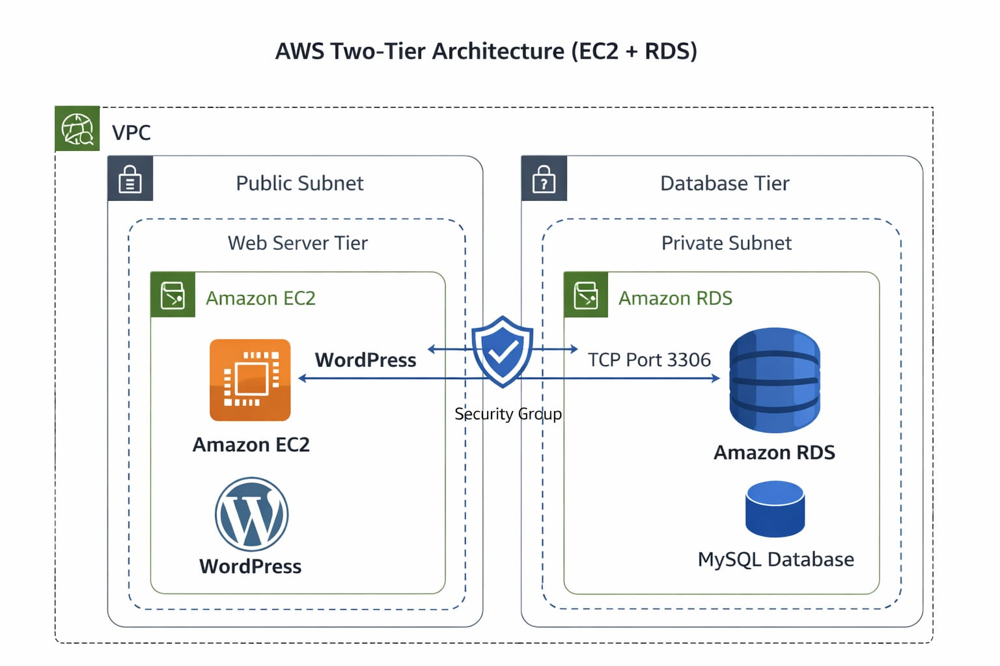

# AWS Two-Tier Architecture (EC2 + RDS)

## 📌 Project Description

This project demonstrates a Two-Tier Architecture deployed manually on AWS using Amazon EC2 and Amazon RDS.

The architecture separates the Web Server (WordPress) and Database (MySQL) layers to improve:

- Security
- Scalability
- Maintainability
- Performance

---

## 🏗 Architectural Diagram

---

## 🚀 Services Used

- Amazon EC2 (Web Server)
- Amazon RDS (MySQL Database)
- Custom VPC
- Public Subnet (Web Tier)
- Private Subnet (Database Tier)
- Internet Gateway
- Route Tables
- Security Groups
- Apache
- PHP
- WordPress

---

## 🧱 Architecture Overview

### 🔹 Web Tier
- EC2 instance deployed in Public Subnet
- Apache + PHP installed
- WordPress configured

### 🔹 Database Tier
- Amazon RDS (MySQL) deployed in Private Subnet
- Database not publicly accessible
- Port 3306 restricted to EC2 Security Group only

---

## 🔐 Security Configuration

- RDS is placed in Private Subnet
- Database port 3306 allowed only from EC2
- SSH (Port 22) restricted to specific IP
- HTTP (Port 80) open for public access
- Separation of application and database layers

---

## ⚙ Implementation Steps

1. Created Custom VPC
2. Created Public and Private Subnets
3. Attached Internet Gateway
4. Configured Route Tables
5. Launched EC2 Instance
6. Installed Apache, PHP, and MySQL client
7. Created RDS MySQL Instance
8. Configured Security Groups
9. Connected WordPress to RDS
10. Verified successful deployment

---

## 🔄 Traffic Flow

User → Internet → EC2 (WordPress) → RDS (MySQL)

---

## 🛠 Troubleshooting & Issues Faced

- Directory listing issue in `/wp-admin`
- Security Group misconfiguration
- WordPress unable to connect to RDS
- 502 Bad Gateway error

### Solutions Applied:

- Disabled directory indexing
- Restarted Apache service
- Corrected inbound/outbound rules
- Verified RDS endpoint and credentials

---

## 📂 Repository Structure
